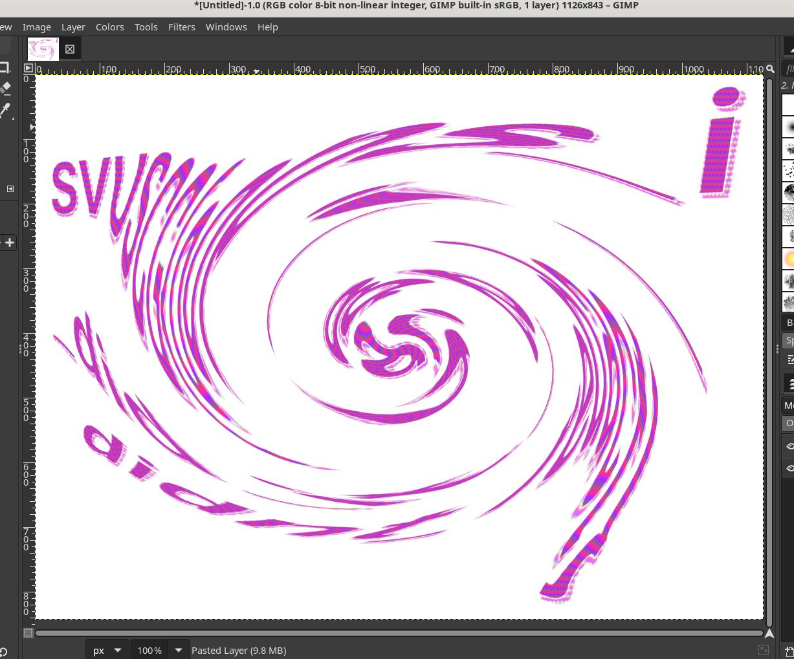
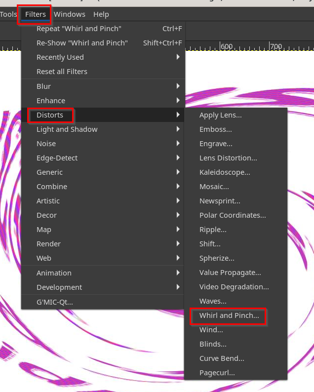
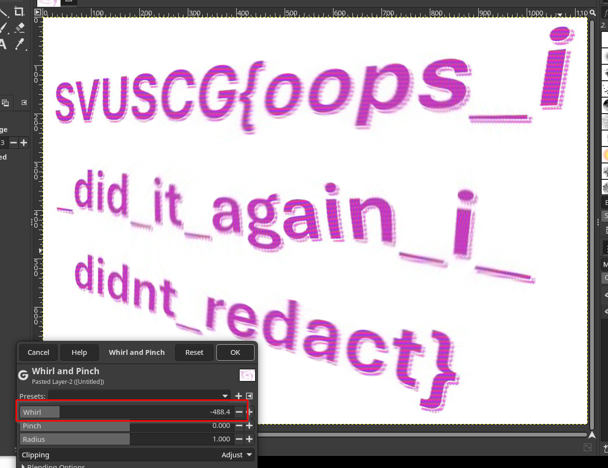

First, the contestant must identify that the provided PDF file is encrypted. 

To crack it, run `pdf2john` and gather the password hash. 

```
┌──(kali㉿kali)-[~/Desktop]
└─$ pdf2john redactable.pdf
redactable.pdf:$pdf$5*6*256*-1028*1*16*11034633a5ecf94eb093665068b146cb*48*830dc3604f6a30e445f73a7f84d0ac57e3a4b8c8e7680bb3c2c400151fa44cfb99639bc06010f3b880a5d33a2164e795*48*3f07119ad41f55aba390965050c10b6d3fae89cbb824c2a990d51f8d7e196a5d53acc983097e4db23ff34e202133ae60*32*055ec514f95e917e6e1a481a0a21f862b93930969daaaf6520e7767d0898b656*32*e809d956274b5facea7c0cd7f07f873d50bb7b84d5e74bc23ac533449cda9792
```

Then, run `hashcat` with the `rockyou.txt` wordlist. After a very brief period, the password will be cracked as `friends4eva`.

```
┌──(kali㉿kali)-[~/Desktop]
└─$ hashcat ./pdf.hash -m 10700 /usr/share/wordlists/rockyou.txt
hashcat (v6.2.6) starting

* Device #1: cpu-sandybridge-Intel(R) Core(TM) i7-9750H CPU @ 2.60GHz, 2913/5890 MB (1024 MB allocatable), 4MCU

Minimum password length supported by kernel: 0
Maximum password length supported by kernel: 127

Hashes: 1 digests; 1 unique digests, 1 unique salts
Bitmaps: 16 bits, 65536 entries, 0x0000ffff mask, 262144 bytes, 5/13 rotates
Rules: 1

Host memory required for this attack: 1 MB

Dictionary cache built:
* Filename..: /usr/share/wordlists/rockyou.txt
* Passwords.: 14344392
* Bytes.....: 139921507
* Keyspace..: 14344385
* Runtime...: 2 secs

$pdf$5*6*256*-1028*1*16*11034633a5ecf94eb093665068b146cb*48*830dc3604f6a30e445f73a7f84d0ac57e3a4b8c8e7680bb3c2c400151fa44cfb99639bc06010f3b880a5d33a2164e795*48*3f07119ad41f55aba390965050c10b6d3fae89cbb824c2a990d51f8d7e196a5d53acc983097e4db23ff34e202133ae60*32*055ec514f95e917e6e1a481a0a21f862b93930969daaaf6520e7767d0898b656*32*e809d956274b5facea7c0cd7f07f873d50bb7b84d5e74bc23ac533449cda9792:friends4eva

Session..........: hashcat
Status...........: Cracked
Hash.Mode........: 10700 (PDF 1.7 Level 8 (Acrobat 10 - 11))
Hash.Target......: $pdf$5*6*256*-1028*1*16*11034633a5ecf94eb093665068b...da9792
Time.Started.....: Sun May 18 21:13:48 2025 (12 secs)
Time.Estimated...: Sun May 18 21:14:00 2025 (0 secs)
Kernel.Feature...: Pure Kernel
Guess.Base.......: File (/usr/share/wordlists/rockyou.txt)
Guess.Queue......: 1/1 (100.00%)
Speed.#1.........:      784 H/s (4.45ms) @ Accel:16 Loops:4 Thr:1 Vec:4
Recovered........: 1/1 (100.00%) Digests (total), 1/1 (100.00%) Digests (new)
Progress.........: 8896/14344385 (0.06%)
Rejected.........: 0/8896 (0.00%)
Restore.Point....: 8832/14344385 (0.06%)
Restore.Sub.#1...: Salt:0 Amplifier:0-1 Iteration:60-64
Candidate.Engine.: Device Generator
Candidates.#1....: fucklife -> fotbal
Hardware.Mon.#1..: Util: 87%

Started: Sun May 18 21:12:18 2025
Stopped: Sun May 18 21:14:01 2025
```

Open the PDF using the `friends4eva` password. Then, identify that there is a large black box on the PDF, we must identify how to access the image behind this. In most PDF viewers, you can either extract the images directly or right click and attempt to copy them. Otherwise, there are PDF extraction tools, such as `pdfimages`, to manually remove images embedded within the document. An example is below:

```
┌──(kali㉿kali)-[~/Desktop]
└─$ pdfimages -all -upw friends4eva ./redactable.pdf ./
```

Now this shows a new image! Opening it, we can see that it's pretty obfuscated though, like it's been swirled. 



Lucky for us though, GIMP has a filter for swirling, we can simply try to un-swirl it by placing negative emphasis on the filter. 



Once completed, we have the flag!

