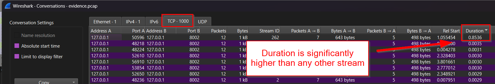

# Questions
There are 1000 requests here with one fraudster. Find which flag retrieved was from the outlier system.


# Notes
This represents finding an outlier stream based on TCP RTT values. This was achieved within this PCAP by renting a server in Singapore through Hetzner, then crafting a series of SOCKS proxies to extend the RTT of the packets on purpose.

The forwarding was achieved by establishing a forwarded and reverse SOCKS tunnel into the VPS with the command below:

```
ssh -R 8002:localhost:8002 -D 9050 root@5.223.53.123
```

During an A/D event, teams who proxy their traffic into separate datacenters than the event will have much more significant RTT times. This can be used to delineate between valid checker traffic and player traffic, even if the requested bytes are the exact same.

The Dockerfile is provided as the fastAPI host for the flag server to build out the PCAP evidence.


# To Solve:
The way to solve this challenge, we need to identify the difference in the timing for the RTT on the streams. This can be found through the Statistics > Conversations windows in Wireshark.



Once this is open, sort by the "Duration" field and there is a clear difference between one of the streams. This is because that one request was proxied through a VPS in Singapore to demonstrate a longer RTT activity.