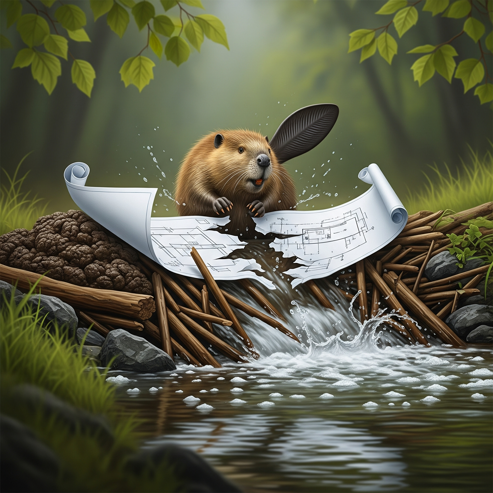

# Title
Busy Beaver

## Purpose
This challenge explores the Busy Beaver contest which attempts to find a solution to the halting problem.

[Explanation and Inspiration](www.catonmat.net/blog/busy-beaver)

## Description

Barney Beaver working on his dam trying to finish his honey-do list from his wife, Belinda Beaver.
But she is very impatient and keeps yelling the honey-do list at him in beaver language "6719, 7734, 7175, 7680, 3856, 4676, 9873, 8810, 5422, 10563, 8008, 8910, 1970, 9598, 4289, 7907, 9857, 7016, 9372, 6838, 9949, 10104, 9314, 3774, 8816, 8343, 9386, 8484, 8563, 9665, 10212, 3728, 4045, 4724, 8000, 5197, 2041, 3157, 3770, 2088, 3937, 3151, 10262", she shouts with fire in her eyes.  I don't even understand how Barney can WORK under these conditions!

After a long day, Barney was sooo tired he accidentally made a huge mistake. He missed a branch and bit right into the blueprint that shows how to construct the dam!  Some critical information has been mangled, but Barney had gotten off to a strong start.  Maybe looking at the partial progress he's made on the dam will jog his memory.

Barney needs to process the rest of the branches properly to finish constructing the dam. He needs your help!  If he doesn't get this job done, he's definitely sleeping on the log tonight.

## Files to Deploy
- chal
- dam.partial

